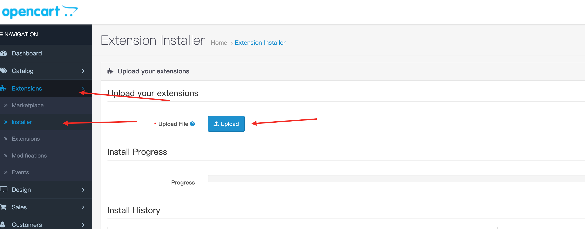
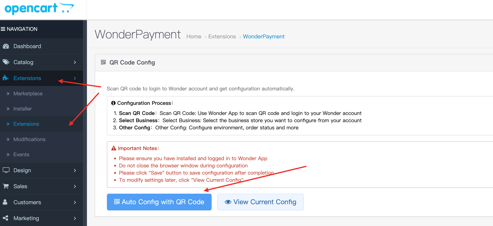
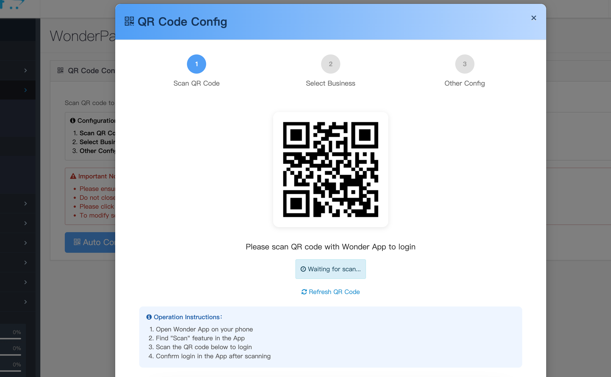
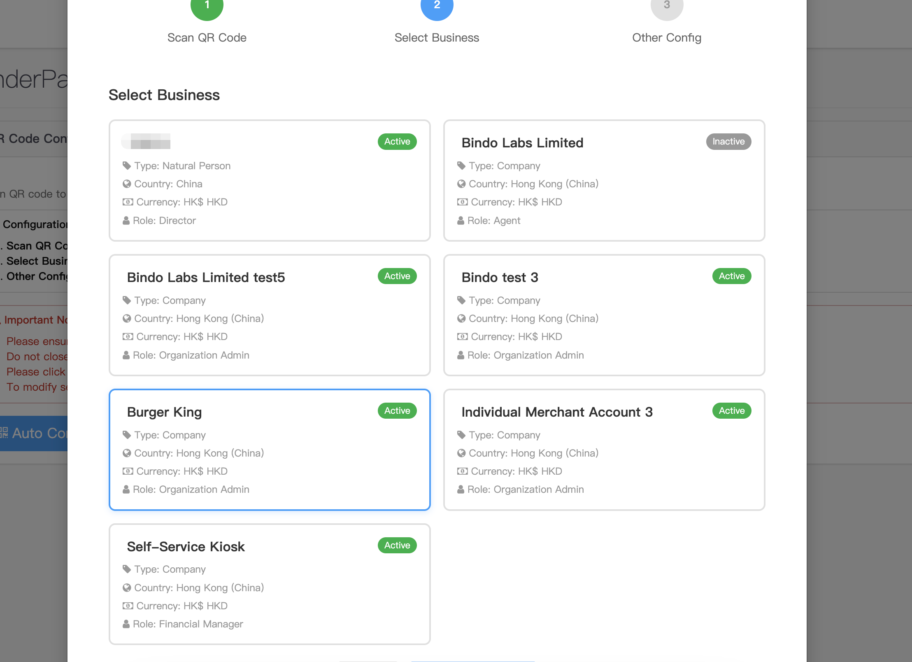
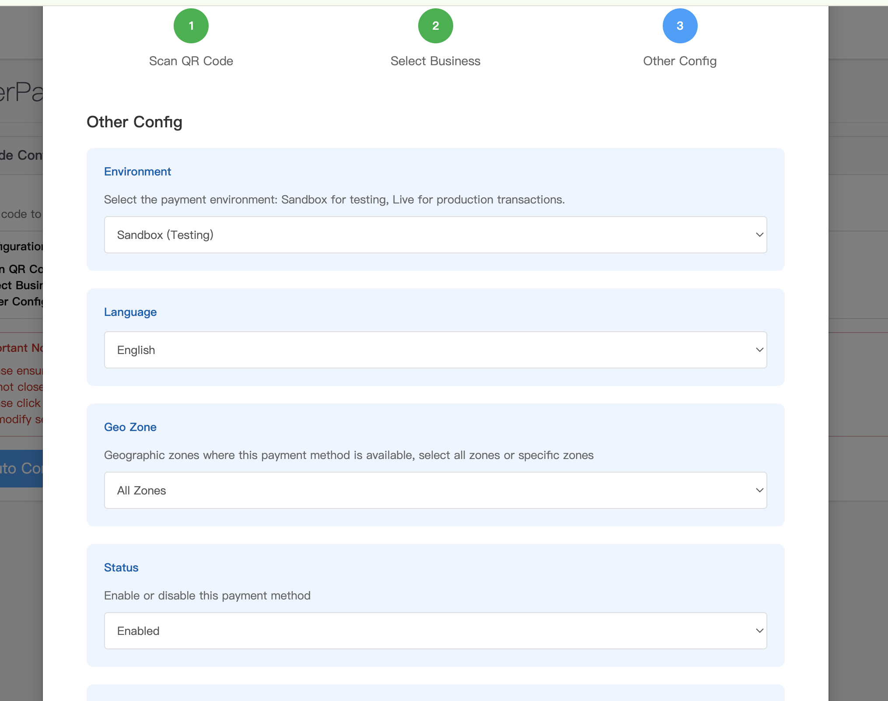
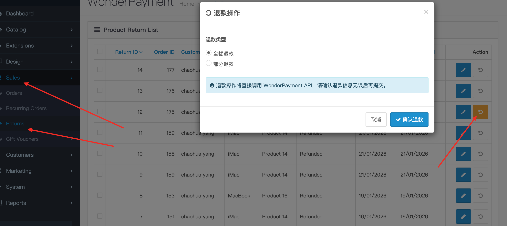

# Wonder Payments for OpenCart

Setup guide for enabling Wonder Payments in OpenCart.

## Setup Steps

1. Install
    - Download the ocmod.zip package and upload it via the OpenCart Extension Installer.
    - 
2. Configure via QR code
    - Click to open the QR-code configuration page.
    - 
3. Log in
    - Open the payment plugin admin page, then scan the QR code to log in.
    - 
4. Select a store
    - After logging in, choose the store to bind from the list.
    - 
5. Configure other settings & save
    - Configure settings other than the store selection.
    - After you finish, save the settings. Make sure the plugin is enabled and the environment is set correctly.
    - 
6. Payments
    - Wonder supports multiple payment methods.
    - 
7. Refunds
    - Wonder supports full and partial refunds, returning funds to the original payment method.
    - 
8. Sync Wonder Payments status
    - If webhook updates are delayed after a payment or refund, use the Sync Wonder Payments Status button on the order page to sync manually.

